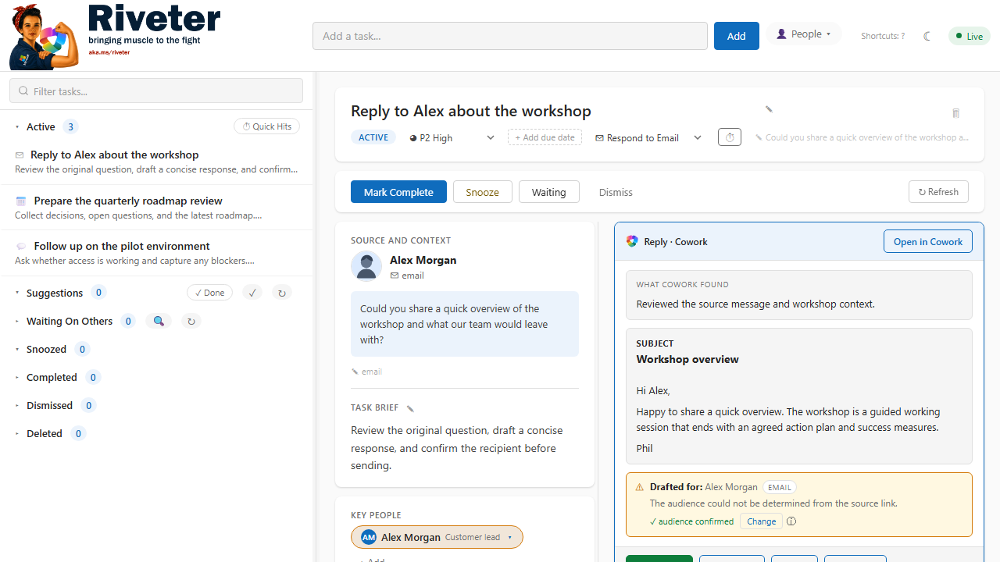
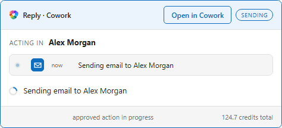

# Riveter

Riveter is a local, AI-assisted task manager for Microsoft 365. It turns
actionable Teams messages, meetings, and flagged inbox mail into a focused task
list, then uses Cowork to research context, draft responses, and carry out an
action only after an explicit review.

Everything durable stays on your machine in SQLite. Microsoft 365 access uses
your delegated WorkIQ and Cowork sessions; Riveter does not ask for or store
separate Graph credentials.



## What it does

- Surfaces direct asks from Teams, meetings, and **flagged Inbox mail**.
- Keeps active, suggested, waiting, snoozed, completed, and dismissed work in
  one local dashboard.
- Adds source context, key people, priority, coaching, and task-specific notes.
- Uses Cowork to research and draft email, Teams, follow-up, preparation, and
  scheduling actions.
- Handles Cowork follow-up questions without losing the running conversation.
- Requires a separate confirmation for external writes and binds execution to
  the reviewed draft and destination.
- Shows live Cowork progress and cumulative credit usage.
- Runs in the foreground or as a Windows tray application at logon.



## Safety model

Riveter treats AI output as a proposal, not authorization.

1. WorkIQ detects or enriches a task.
2. Cowork researches and creates a preview behind a write barrier.
3. You review the destination and editable draft in Riveter.
4. A separate confirmation starts execution.
5. Riveter verifies that Cowork's requested write matches the approved action.
6. Ambiguous delivery is reported as unconfirmed rather than guessed.

## Requirements

### Base dashboard

- Windows 10 or 11
- Python 3.11+
- Git

### Microsoft 365 automation

- [GitHub Copilot CLI](https://docs.github.com/en/copilot/how-tos/copilot-cli/set-up-copilot-cli/install-copilot-cli)
  installed and authenticated
- A Copilot CLI environment that exposes the WorkIQ tools
- Microsoft 365 access for the signed-in account

### Cowork actions

- Microsoft Cowork CLI access and entitlement
- An authenticated Cowork session

The dashboard and local task lifecycle work without WorkIQ or Cowork. Sync,
context retrieval, drafting, and direct actions require the corresponding
service.

## Install on Windows

Open PowerShell and run:

```powershell
git clone https://github.com/topness-msft/TodoIQ.git
Set-Location TodoIQ

py -3.11 -m venv .venv
Set-ExecutionPolicy -Scope Process Bypass
.\.venv\Scripts\Activate.ps1

python -m pip install --upgrade pip
python -m pip install -r requirements.txt
```

Install GitHub Copilot CLI if it is not already available:

```powershell
winget install GitHub.Copilot
copilot
```

Inside Copilot CLI, run `/login` if authentication is requested. Your Copilot
environment must also have WorkIQ available; Riveter launches commands with the
`workiq` tool explicitly enabled.

If your organization provides the Cowork CLI, install or update it with the
Microsoft preview installer and authenticate:

```powershell
irm https://aka.ms/cowork/ps1 | iex
cowork auth login
```

Confirm the command-line dependencies:

```powershell
python --version
copilot --version
cowork --version
```

### Start in console mode

```powershell
python -m src.app 8766
```

Open [http://localhost:8766](http://localhost:8766). The first start creates
`data/claudetodo.db` and applies any schema migrations automatically.

### Install the tray application

After the console test succeeds, stop it with `Ctrl+C`, then register Riveter at
Windows logon:

```powershell
python scripts/install_startup.py
```

The installer registers a scheduled task named `TodoNess` (the legacy internal
task name), installs `pystray` and Pillow if needed, and asks whether to start
the tray immediately.

The tray menu provides:

- **Open Dashboard**
- **Sync Now**
- **Stop & Exit**

To remove the scheduled task and stop the tray process:

```powershell
python scripts/uninstall_startup.py
```

## First-run checks

Use these checks before connecting real work:

```powershell
# Server and database
Invoke-WebRequest http://localhost:8766/api/stats -UseBasicParsing

# Main dashboard
Invoke-WebRequest http://localhost:8766/ -UseBasicParsing

# Alternate task surface
Invoke-WebRequest http://localhost:8766/todo -UseBasicParsing

# Runner state
Invoke-RestMethod http://localhost:8766/api/runner-status
```

Each HTTP request should return `200`. The runner response should not report an
orphaned process.

## Examples

### Add a task manually

Enter this in the dashboard quick-add field:

```text
Reply to Alex with a short overview of the workshop
```

Riveter stores the task immediately, then asks Copilot CLI to parse its action
type, priority, people, and useful context.

The equivalent API call is:

```powershell
Invoke-RestMethod http://localhost:8766/api/tasks `
  -Method Post `
  -ContentType "application/json" `
  -Body '{"title":"Reply to Alex with a short overview of the workshop"}'
```

### Refresh from Microsoft 365

Select **Refresh** in the dashboard. Riveter runs `/todo-refresh`, which checks:

- direct asks from Teams and meetings,
- items where you are waiting for a response, and
- flagged messages in the Inbox.

Broad unflagged email scanning is intentionally disabled because WorkIQ cannot
reliably restrict those results to Inbox.

### Draft and send an email

1. Open an email task.
2. Start the Cowork action.
3. Answer any follow-up question Cowork asks.
4. Review the finding, recipient, subject, and editable body.
5. Select **Send email**.
6. Confirm the exact draft and destination.

Email tasks use the configured work-email voice skill. Cowork cannot send from
the preview turn; only the separately confirmed execution turn can request the
write.

### Put a task into Waiting

Use **Waiting** after you send a request or hand work to someone else. Riveter
periodically checks person-scoped email and Teams context for a reply and keeps
the task visible until it is resolved.

## Copilot commands

Riveter invokes these project commands through Copilot CLI:

| Command | Purpose |
|---|---|
| `/todo` | Show task status and the dashboard URL |
| `/todo-add "text"` | Add and enrich a task from natural language |
| `/todo-parse` | Parse tasks added from the dashboard |
| `/todo-refresh` | Scan Microsoft 365 for actionable work |
| `/todo-review` | Review tasks needing attention |
| `/waiting-check` | Look for activity on waiting tasks |
| `/suggestion-check` | Check whether suggested work is already resolved |

Task-focused skills include `respond-email`, `schedule-meeting`,
`teams-message`, `follow-up`, and `prepare`.

## Configuration

Per-user settings live in `data/settings.json`, which is intentionally
gitignored:

```json
{
  "cowork_api_transport": true,
  "cowork_voice": {
    "teams": "work-teams-voice",
    "email": "work-email-voice",
    "default_channel": "teams"
  },
  "meeting_preferences": {
    "default_minutes": 25,
    "start_offset_minutes": 5,
    "notes": ""
  }
}
```

- `cowork_voice` selects the voice skill named in prompts for each channel.
  Set a value to `null` to use only Riveter's built-in writing rules.
- `default_channel` chooses a writing register for manually entered tasks that
  have no channel signal. It never chooses a recipient.
- `meeting_preferences` applies standing duration, start-offset, and free-text
  scheduling preferences.

Malformed or missing settings fall back to safe defaults.

## Data and logs

Runtime data is local and gitignored:

| Path | Contents |
|---|---|
| `data/claudetodo.db` | SQLite source of truth |
| `data/backups/` | Automatic SQLite backups |
| `data/todoness.log` | Tray and server logs |
| `data/settings.json` | Per-user settings |
| `data/todoness.pid` | Single-instance guard |

Do not copy the database while Riveter is running. Stop the tray or console
server first.

## Troubleshooting

### `copilot CLI not found on PATH`

Restart PowerShell after installing GitHub Copilot CLI, then run
`copilot --version`.

### Cowork says authentication is required

```powershell
cowork auth login
```

Riveter performs one silent authentication recovery and one retry. If that
fails, interactive login is required.

### Port 8766 is already in use

Another Riveter console or tray instance is probably running. Stop it from the
tray menu or run `scripts/uninstall_startup.py` before starting another copy.

### The tray exits immediately

Check `data/todoness.log`. The installer also reports stale PID files and port
ownership failures instead of claiming a successful start.

## Development

```powershell
python -m pip install pytest pytest-playwright
python -m playwright install chromium

# Unit tests
python -m pytest -q

# Browser and visual tests
python -m pytest -q -m e2e
```

See [CLAUDE.md](CLAUDE.md) and
[`.github/agents/PROJECT-CONTEXT.md`](.github/agents/PROJECT-CONTEXT.md) for the
architecture, test protocol, deployment probes, and safety invariants.
